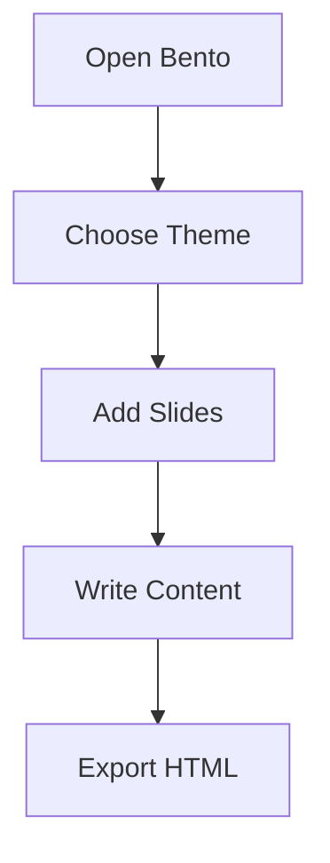

You don't need another $150/year subscription to make a great presentation. Last week, a single HTML file called Bento hit #1 on Hacker News with 956 points and 220 comments — and it's the best **HTML slides alternative to PowerPoint** you probably haven't tried. Here's what it is, how it works, and how to build your first deck in under 10 minutes.

## What Is Bento?

Bento (bento.page/slides) is a presentation tool that lives entirely inside one browser window. Open the HTML file, and you get a full WYSIWYG editor — themes, code highlighting, Mermaid diagrams, LaTeX math, slide transitions, print-to-PDF, and a publishable single-file output that you can email or host anywhere. All of it is **MIT-licensed open source**.

The key idea: one file in, one file out. You don't install anything, sign up for anything, or upload anything to a server. The editor and the viewer are the same file. When you save your presentation, it's a single `.html` file with everything embedded — CSS, JavaScript, fonts, images, even diagrams. Open it on any modern browser and it works, online or offline.

Created by Brett Bromley, Bento is now on [GitHub](https://github.com/brettbromley/bento) under the MIT license. It occupies a narrow but sharp niche: the gap between "too complicated" (PowerPoint, Keynote) and "too technical" (Marp, Slidev, reveal.js). You don't need to know Markdown, run a Node server, or learn a DSL. You just open it and start typing.

## Bento vs PowerPoint vs Keynote vs Google Slides — Comparison Table

| Feature | Bento | PowerPoint | Keynote | Google Slides | Slides.com | Marp | Slidev |
|---------|-------|------------|---------|---------------|------------|------|--------|
| **Price** | Free (MIT) | $6.99–$22/mo | Free (Apple only) | Free (personal) / $6+/mo | Free limited / $15+/mo | Free (MIT) | Free (MIT) |
| **Single HTML export** | ✅ One file | ❌ | ❌ | ❌ | ❌ | ❌ | ❌ |
| **Offline use** | ✅ | ✅ | ✅ | ⚠️ Limited | ❌ | ✅ | ✅ |
| **No account required** | ✅ | ❌ | ✅ (Apple ID) | ❌ | ❌ | ✅ | ✅ |
| **Zero install** | ✅ | ✅ | ✅ | ✅ | ❌ | ⚠️ (VS Code ext) | ❌ (Node.js req.) |
| **Code highlighting** | ✅ Built-in | ❌ | ❌ | ❌ | ✅ | ✅ | ✅ |
| **Mermaid diagrams** | ✅ Built-in | ❌ | ❌ | ❌ | ❌ | ❌ | ✅ |
| **LaTeX math** | ✅ Built-in | ❌ | ❌ | ❌ | ❌ | ⚠️ Extension | ✅ |
| **Collaboration** | ❌ | ✅ (OneDrive) | ✅ (iCloud) | ✅ Real-time | ✅ (Paid) | ❌ | ❌ |
| **Presenter notes** | ❌ | ✅ | ✅ | ✅ | ✅ | ❌ | ✅ |
| **Custom fonts** | ❌ | ✅ | ✅ | ✅ | ✅ | ❌ | ✅ |
| **Export to PPTX** | ❌ | ✅ | ✅ | ✅ | ❌ | ✅ (CLI) | ✅ (CLI) |
| **Team pricing** | $0 | $99–$264/user/yr | $0 | $72–$216/user/yr | $180–$360/user/yr | $0 | $0 |
| **Mobile responsive** | ✅ | ⚠️ | ❌ | ✅ | ✅ | ✅ | ✅ |
| **GitHub / OSS** | ✅ (MIT) | ❌ | ❌ | ❌ | ❌ | ✅ (MIT) | ✅ (MIT) |

The table makes it clear: Bento trades collaboration and cloud features for simplicity, portability, and zero cost. It's not a replacement for Google Slides when you need six people editing a deck simultaneously. But for 90% of standalone presentations — pitch decks, talks, internal reports — the trade-off is a net win.

## Step-by-Step: Build Your First Bento Deck

### Step 1: Open Bento

Go to **[bento.page/slides](https://bento.page/slides/)**. That's it. The page is the app — everything loads in your browser. No signup, no download, no "start your free trial."

You'll see a blank canvas with an editing toolbar at the top. You can also download the HTML file from GitHub and open it locally for a fully offline experience.

### Step 2: Choose a Theme

Click the theme picker in the toolbar. Bento ships with several built-in themes:

- **Default Light** — clean white background, dark text, good for most decks
- **Default Dark** — dark background, light text, great for tech talks
- **Minimalist** — maximize content-to-chrome ratio

Pick one that fits your audience. You can change this at any time — themes are CSS-only, so switching doesn't corrupt your content.

### Step 3: Add Slides

Click **+ New Slide** to add slides. Each slide lets you choose a layout:

- **Title slide** — big heading, subtitle, optional background
- **Content slide** — heading + body text (markdown-style formatting)
- **Code slide** — monospaced editor with syntax highlighting
- **Image slide** — full-bleed image with optional caption
- **Blank slide** — place anything anywhere

You can reorder slides by dragging them in the sidebar thumbnails.

### Step 4: Add Content

Type directly into the editor. Bento supports:

- **Bold**, *italic*, `inline code`, ~~strikethrough~~
- **Bullet lists** and 1. **numbered lists**
- **Code blocks** with language tags (e.g., ````python print("hello")````)
- **Mermaid diagrams** — type a Mermaid code block and it renders inline
- **LaTeX math** — wrap expressions in `$...$` or `$$...$$`

For example, to add a Mermaid flowchart:



Just paste that into a code slide with the `mermaid` language tag.

### Step 5: Add Transitions

Each slide can have a transition effect (fade, slide, zoom). Set it per-slide or globally. Transitions are CSS-based and hardware-accelerated — no jank.

### Step 6: Export

This is Bento's superpower. Click **Export → Save as HTML**. You get a **single `.html` file** that contains:

- All your slides with full formatting
- All themes and CSS
- All code highlighting and diagram rendering
- All embedded images (as base64 data URIs)
- No external dependencies

You can:
- **Email** it as an attachment — it opens in any browser
- **Host it** on GitHub Pages, Netlify, Vercel, or any static server
- **Print to PDF** using the browser's print dialog (Ctrl+P / Cmd+P) — the print CSS is built-in
- **Keep it offline** — no server required

### Step 7: Present

Open the exported HTML file, press **Fullscreen** (F11 / fullscreen button), and go. Use arrow keys to navigate slides. The audience gets the same file you have — no font-loading delays, no "can you advance the slide?", no Wi-Fi dependence.

## 3 Real Deck Templates

### Template 1: Startup Pitch Deck

- **Layout:** Title → Problem → Solution → Market Size → Product → Traction → Team → Ask
- **Theme:** Dark (gives a premium feel)
- **Key slides:** Use a Mermaid diagram for the market landscape, code slide for technical demos
- **Export:** Single HTML to send to investors + PDF via browser print for offline readers
- **Pro tip:** Bento's dark theme looks as polished as a $500 pitch deck template

### Template 2: Sales Presentation

- **Layout:** Opening → Customer Pain → Your Offering → Case Study → ROI → Pricing → Next Steps
- **Theme:** Default Light (professional, readable in any lighting)
- **Key slides:** Image slides for customer logos, Mermaid diagrams to show ROI flow
- **Export:** PDF for email follow-ups, HTML for in-person demos
- **Pro tip:** The HTML file loads instantly on any client's laptop — no "sorry, Google Slides is buffering"

### Template 3: Conference Talk

- **Layout:** Title → Agenda → 6-8 Content Slides → Thank You / Q&A
- **Theme:** Dark (projects well on conference screens)
- **Key slides:** Code slides for tech talks, LaTeX for math-heavy content, large image slides for demos
- **Export:** HTML for the projector (open in browser fullscreen) + PDF for attendees
- **Pro tip:** Bento HTML files are typically 10-50KB for text-heavy decks — they load in milliseconds on any conference Wi-Fi

## Best For / Worst For

**Bento is best for:**
- One-person decks — pitch decks, conference talks, class lectures
- Developers who want code highlighting and diagrams without switching tools
- Anyone who wants a presentation that works 100% offline
- Sharing decks via email or as a static web page
- Minimalists who resent PowerPoint's feature bloat

**Bento is worst for:**
- Team collaboration — no real-time editing, no version history
- Complex animations — basic transitions only, no custom timing
- Video-heavy presentations — no native video embedding
- Large image decks — base64 encoding blows up file size
- Enterprise compliance — no access controls, IT admin, or audit trails

## Pricing

| Tool | Free Tier | Individual Monthly | Annual (Individual) | Team/Business |
|------|-----------|-------------------|---------------------|---------------|
| **Bento** | Full product (MIT) | $0 | $0 | $0 |
| **PowerPoint** | Web app (basic) | $6.99/mo (M365 Personal) | $69.99/yr | $8.25–$22/mo per user |
| **Keynote** | Full product | $0 (Apple device req.) | $0 | $0 |
| **Google Slides** | Full product (personal) | $0 | $0 | $6–$22/mo per user |
| **Slides.com** | 5 slides, branded | $15/mo (Pro) | $108/yr | $30/mo per user |
| **Marp** | Full product (MIT) | $0 | $0 | $0 |
| **Slidev** | Full product (MIT) | $0 | $0 | $0 |

**Bento is free.** Not "free with a watermark." Not "free for 14 days." MIT open-source — free forever, even for commercial use. [AFFILIATE: Bento is free — no affiliate — but if you need design assets, try Canva Pro for templates and graphics.]

**PowerPoint** costs at minimum $69.99/year, and that's the consumer version. Business setups run $99–$264/user/year.

**Google Slides** is free for personal use, but businesses pay $72+/user/year. And you're tied to Google's ecosystem — no offline editing without the Chrome extension, and your data lives on Google's servers.

**Slides.com** is the only SaaS tool that charges a premium for its standalone presentation service. $180/year for Pro is more than most casual presenters should pay.

**Marp and Slidev are free** — open-source like Bento — but require technical skills. Marp needs VS Code or CLI fluency. Slidev needs Node.js and npm. Bento needs a browser tab.

## FAQ

### Can I use Bento offline?

Yes. Download the HTML file from GitHub or open it once while online, then save a local copy. The entire app runs client-side — no server calls after load.

### Can I export Bento presentations to PowerPoint?

No. Bento is a one-way street — HTML in, HTML out. If you need PPTX output, use Marp or Slidev (both can export to PowerPoint via CLI). But honestly, if you're sending a deck to someone who insists on `.pptx`, open your HTML > Print to PDF > done. PDF is more universal anyway.

### Can multiple people edit a Bento deck at the same time?

No. Bento is a single-user tool. There's no real-time collaboration, no conflict resolution, no shareable edit link. If your workflow requires Google Slides-style multi-editing, stick with Google Slides or [LINK: real-time presentation collaboration tools].

### Does Bento support presenter notes?

No — this is the most commonly requested feature on the HN thread. Workaround: add a text box at the bottom of each slide with your notes, or run a second browser window with your notes document. The author has indicated on GitHub that presenter notes are on the roadmap.

### How large is a typical Bento HTML file?

A text-heavy deck with a few diagrams runs 10-50KB. An image-heavy deck can hit 1-5MB (images are base64-encoded inline). Compare that to a PowerPoint `.pptx` (which is a ZIP of XML files) at 5-20MB for similar content, or a Keynote file that can easily exceed 50MB. Bento's single small HTML file is genuinely impressive.

## Which One Should You Pick?

If you make presentations alone, want them to look great, and hate managing subscriptions — **use Bento**. It's free, works offline, and produces files so portable they feel like magic. Open bento.page/slides right now, and you'll have a deck ready before you'd finish installing Microsoft Office.

If you collaborate on decks with a team, need native video, or must output `.pptx` — stick with **Google Slides** (free for personal, $6+/mo for business) or **PowerPoint** ($69.99/yr). Just know you're paying for features you may not need.

For the rest of us — founders pitching investors, developers giving tech talks, educators preparing lectures, consultants making client decks — Bento is the best tool you didn't know existed. And it's one file. Open it and write.

*Not financial advice. Pricing based on official sources as of July 2026. Bento is MIT-licensed open source — no warranty, use at your own risk.*
